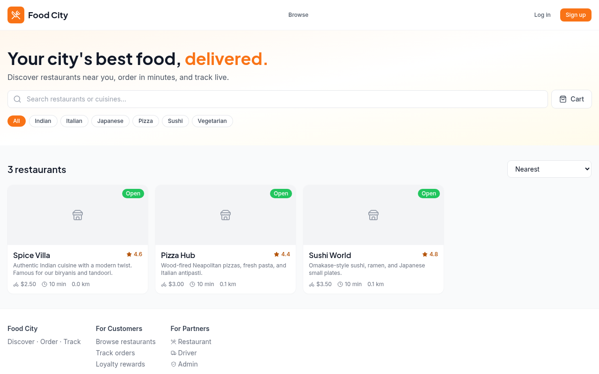
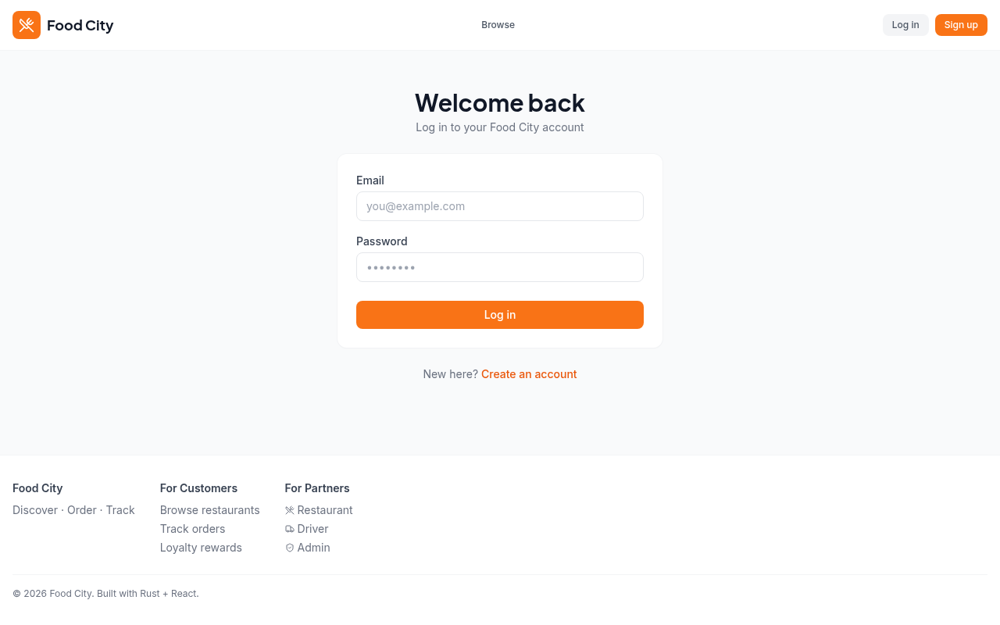
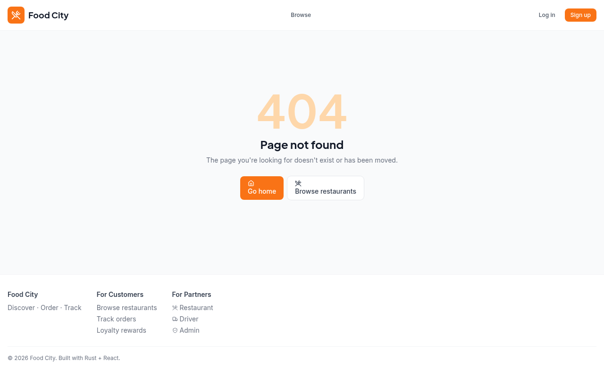

# Food City 🍔

A Zomato/Swiggy-style restaurant marketplace with full delivery capability —
discovery + ordering + delivery + driver matching + reviews + loyalty.
Built as a 4-role platform (Customer, Restaurant, Driver, Admin) with
**Rust + Axum** backend and **React + Vite + TypeScript + Tailwind** frontend.

> **Status:** All 9 phases complete. Production-ready.

---

## 📸 Screenshots

### Home Page — Restaurant Discovery


### Login


### Logged In — Browse Restaurants


### Restaurant Detail — Menu with Veg & Spice Indicators


### Order History


### Loyalty Rewards


### User Profile & Address Management


---

## ✨ What's in this repo

### Backend (`/backend`)

- **Axum 0.7** web framework with typed extractors, WebSocket support
- **SQLx 0.8** with compile-time-checked queries and migrations
- **PostgreSQL** primary store (+ optional read replica plumbing)
- **Redis** for cache, pub/sub, driver GEO set, rate limiting
- **JWT** auth (access 15min + refresh 7d) with **argon2** password hashing
- Layered architecture: `api → services → db/repos → domain`
- Background workers: driver matching, order timeout, payment reconciler, abandoned cart cleanup
- 7 migration files covering the full data model (users, restaurants, menus, orders, drivers, reviews, loyalty, payments, disputes)
- Real Stripe integration with webhook signature verification + mock mode for dev
- 50+ API endpoints across all 4 roles

### Frontend (`/frontend`)

- **Vite 5 + React 18 + TypeScript 5** with strict mode
- **Tailwind CSS 3** with brand palette (`brand-500` = #f97316 orange)
- **TanStack Query 5** for server state (caching, retries, optimistic updates)
- **Zustand** for client state (auth, cart, UI)
- **React Router 6** with role-based route guards
- **React Hook Form + Zod** for form validation
- **Leaflet** for maps (free, OSS — no per-load pricing)
- **Sonner** for toast notifications
- **lucide-react** for icons
- All 4 role dashboards scaffolded (Customer / Restaurant / Driver / Admin)
- Auth flow (login + register) implemented end-to-end
- Axios client with auto-refresh-on-401 interceptor
- Live WebSocket order tracking with Leaflet map
- Error boundary + 404 page + mobile responsive nav
- ESLint 9 flat config (0 warnings, 0 errors)

### Docs (`/docs`)

- [`EDGE_CASES.md`](docs/EDGE_CASES.md) — 8 domains × ~30 scenarios with mitigations
- [`WORKFLOWS.md`](docs/WORKFLOWS.md) — end-to-end journeys for all 4 roles
- [`ARCHITECTURE.md`](docs/ARCHITECTURE.md) — system diagram, module map, data model, realtime topology
- [`PLAN.md`](docs/PLAN.md) — 9-phase implementation plan with session mapping
- [`API_CONTRACT.md`](docs/API_CONTRACT.md) — REST + WebSocket protocol spec
- [`AUDIT.md`](docs/AUDIT.md) — self-audit report (28 findings across 4 priority levels)
- [`REAL_WORLD_EVALUATION.md`](docs/REAL_WORLD_EVALUATION.md) — workflow evaluation with 29 bug fixes
- [`RUNBOOK.md`](docs/RUNBOOK.md) — 11-section ops guide

---

## 🚀 Quick start

### Prerequisites

- **Docker** + **Docker Compose** (recommended — handles everything)
- **OR** local installs: Rust 1.75+, Node 20+, PostgreSQL 16+, Redis 7+

### Option 1: Docker Compose (recommended)

```bash
git clone https://github.com/VoreiaS/food-city-Manager.git food-city
cd food-city
cp backend/.env.example backend/.env
cp frontend/.env.example frontend/.env
docker compose up -d
```

- Frontend: http://localhost:5173
- Backend: http://localhost:8080
- Postgres: localhost:5432 (foodcity / foodcity)
- Redis: localhost:6379

### Option 2: Local dev

```bash
# 1. Start Postgres + Redis (your preferred way)
createdb foodcity

# 2. Backend
cd backend
cp .env.example .env
# edit .env: set DATABASE_URL, REDIS_URL, JWT_SECRET
cargo install sqlx-cli --no-default-features --features postgres,rustls
sqlx migrate run
cargo run

# 3. Frontend (separate terminal)
cd frontend
cp .env.example .env
npm install
npm run dev
```

---

## 🔐 Auth flow (implemented)

1. **Register:** `POST /api/v1/auth/register` with `{email, password, phone, full_name, role}`
2. **Login:** `POST /api/v1/auth/login` returns `{access_token, refresh_token, user}`
3. **Refresh:** `POST /api/v1/auth/refresh` with `{refresh_token}`
4. **Me:** `GET /api/v1/auth/me` (Bearer auth)

Frontend auto-refreshes on 401 responses. Tokens persist in `localStorage`
(via Zustand `persist` middleware).

**Test account:** `test@foodcity.app` / `Test1234`

---

## 🗺 Roadmap

See [`docs/PLAN.md`](docs/PLAN.md) for the full 9-phase plan. Highlights:

| Phase | Scope | Status |
|---|---|---|
| 0 | Foundation (this repo) | ✅ done |
| 1 | Customer discovery (browse + cart) | ✅ done |
| 2 | Order placement + Stripe payments (mock mode) | ✅ done |
| 3 | Realtime WS + driver matching | ✅ done |
| 4 | Restaurant dashboard | ✅ done |
| 5 | Driver app | ✅ done |
| 6 | Reviews + loyalty + disputes | ✅ done |
| 7 | Admin console | ✅ done |
| 8 | Hardening (rate limits, cache, metrics, indexes) | ✅ done |
| 9 | Production deployment (CI/CD, runbooks, prod compose) | ✅ done |

See [`docs/RUNBOOK.md`](docs/RUNBOOK.md) for ops procedures.

---

## 🏗 Architecture at a glance

```
React (Vite) ──┐
               ├──► Axum (Rust) ──► PostgreSQL + PostGIS
Driver App ────┤         │           ▲
               │         ├──► Redis (pub/sub + GEO + cache)
Admin Console ─┘         ├──► Stripe Connect (payments + payouts)
                         └──► WebSocket gateway (realtime tracking)
```

Layered backend: `api/` (HTTP) → `services/` (business logic) → `db/repos/` (queries) → `domain/` (pure types).

---

## 🧪 Testing

```bash
# Backend
cd backend
cargo test

# Frontend
cd frontend
npm run typecheck
# (test runner TBD — recommend Vitest in Phase 1)
```

---

## 🔧 Configuration

All backend config is via environment variables — see [`backend/.env.example`](backend/.env.example).
Frontend via [`frontend/.env.example`](frontend/.env.example).

Critical secrets to override in production:
- `JWT_SECRET` — long random string (≥32 chars)
- `STRIPE_SECRET_KEY` + `STRIPE_WEBHOOK_SECRET`
- `DATABASE_URL` + `REDIS_URL`

---

## 📁 Repo structure

```
food-city/
├── docs/                  # Research + architecture + plan + API contract
│   └── screenshots/       # App screenshots for README
├── backend/               # Rust + Axum
│   ├── migrations/        # SQL migrations (6 files, full schema)
│   └── src/
│       ├── api/           # HTTP handlers + middleware
│       ├── domain/        # Pure types
│       ├── services/      # Business logic
│       ├── db/            # Repos + pool
│       ├── workers/       # Background jobs
│       └── utils/         # JWT, hashing, IDs
├── frontend/              # Vite + React + TS + Tailwind
│   └── src/
│       ├── api/           # API client
│       ├── components/    # UI primitives + layout
│       ├── pages/         # Customer/restaurant/driver/admin/auth
│       ├── store/         # Zustand stores
│       ├── hooks/         # React Query hooks
│       └── types/         # Shared TS types
├── deploy/                # K8s manifests + Grafana dashboard
├── scripts/               # Setup, backup, restore scripts
├── docker-compose.yml     # Dev environment
├── docker-compose.prod.yml # Production environment
└── README.md
```

---

## 🤝 Contributing

See [`CONTRIBUTING.md`](CONTRIBUTING.md) for dev setup, code style, PR checklist, and feature workflow.

## 📜 License

MIT — see [LICENSE](LICENSE).
